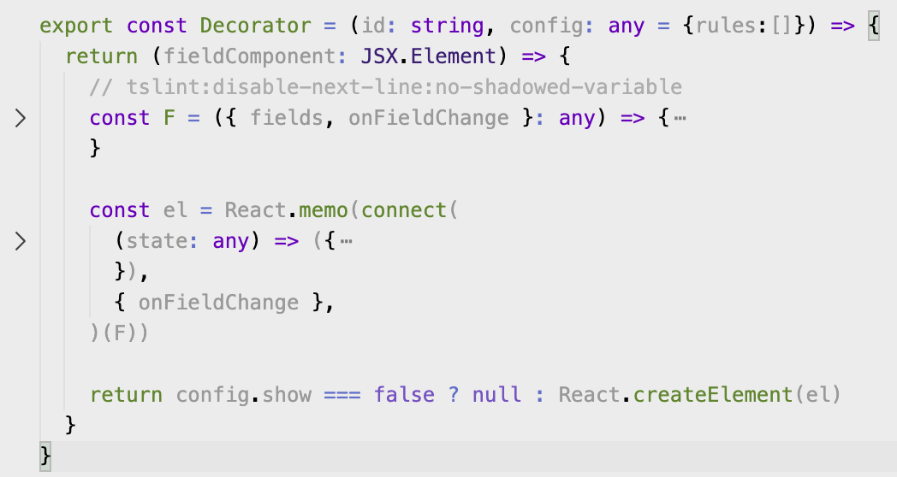

# HOC a more involved scenario

Welcome back! Let's see what else HOC can help us with let's dig in.

# Example - input field decorator

## Motivation

Quite often we have fields that need state to be passed in and controlled value be dispatched/collected when changes. This is what React refers to as controlled component. We could write onChange to each input field individually and hook up whatever state management you have setup redux, flux, etc. However, this could quickly become an annoyance if we have tons of input components.

Also when these fields have complex validation logics such as field-x is invalid when field-y contains the words 'thanos', or field-z has multiple scenarios to be validated each has a different error message. An example would be embossing name on credit card needs to validate: _A. if it is empty. B. if contains profane words. C. if it is within a certain length or it won't fit in on the card._

With HOC, we can address the issues above in a clear and declarative manner.

## Decorator

Here is the overview of decorator:



The Decorator is a function takes two parameters: id of the wrapped component and configuration object.

Configuration object has properties of: rules, initialValue, correlationId and show - visibility toggle.

```typescript
Decorator('Earth', {
  correlationId: 'marvel',
  rules: [
    {
      type: 'text',
    },
    {
      required: true,
      message: 'Please enter a Marvel name!',
    },
    {
      name: 'EarthRule',
      validator: IsThanosOnEarth,
      message: 'Thanos is on Earth',
    },
    {
      name: 'AsgardRule',
      validator: IsThanosInAsgard,
      message: 'Thanos is in Asgard',
    },
  ],
  initialValue: 'This is Earth'
})(<input key='earth' className="spacing" />)
```

And it returns an HOC function that takes an element as parameter and returns the wrapped component with extended props: id, name, type, value, onChange, etc.

Let's take break it up:

> usePrevious custom hook - to retrieve previous value, so then when previous value !== current value we apply focus on the component.

```typescript
/*
useEffect hook effect might run after several renders asynchronously.
For this case we should use useLayoutEffect hook which runs immediately
after each render and in addition this logic doesn’t block painting.
*/
const usePrevious = (value: any) => {
  const ref = useRef()
  useLayoutEffect(() => {
    ref.current = value
  })
  return ref.current
}

const prevValue = usePrevious(fields[id])
```

A custom hook is basically a function we write that uses built react or 3rd party hooks.

It is in essence, a form of code sharing too.

_It gets very interesting when we throw HOC and custom hook together in the mix._

We are able to remember previous value because of two effects:

- userRef() will always return the same value unless we set: ref.current = newValue

- useLayoutEffect() will only run after component is rendered

```typescript

//1. first time
const prevValue = usePrevious(undefined)
//preValue === undefined
//ref.current === undefined


//2. we pass 1
const prevValue = usePrevious(1)

const usePrevious = (value: any) => {
  const ref = useRef()

  //this will not run until rendered
  useLayoutEffect(() => {
    ref.current = value
  })

  //this will return first
  //which is undefined
  return ref.current
}
//preValue === undefined
//ref.current === undefined

//after render this will run
useLayoutEffect(() => {
  ref.current = value
})
//now ref.current is 1
//preValue is still undefined


//3. we pass 2
const prevValue = usePrevious(2)

const usePrevious = (value: any) => {
  const ref = useRef()

  //this will not run until rendered
  useLayoutEffect(() => {
    ref.current = value
  })

  //this will return first
  //which is 1
  return ref.current
}

//after render this will run
useLayoutEffect(() => {
  ref.current = value
})
//now ref.current is 2
//preValue is still 1
```

> Rule engine - whenever input value changes we run through all the validation rules passed in as config.rules. onFieldChange is a redux action dispatch we use to propagate validation result along with other information to parent.

```typescript
const onChange = (v: any) => {
  const failedRules = RuleEngine(config.rules, v, fields)
  
  onFieldChange(
    id,
    v,
    failedRules,
    config.correlationId)
}
```

> React.cloneElement() - a component agnostic way of extending existing component props.

```typescript
const extendedProps = {
  ref: callbackRef,
  id,
  name: id,

  type: config.rules &&
    (config.rules.find((r: any) => r.type) || {}).type
    || 'text',

  value: fields[id] === undefined ?
    config.initialValue :
    fields[id],

  onChange: (e: any) => onChange(e.target.value),
}

return React.cloneElement(
  fieldComponent,
  extendedProps)
```

> function F - this is a functional component we use to piece together usePrevious() for auto focus, validation onChange and props extension.

```typescript
const F = ({ fields, onFieldChange }: any) => {
  const prevValue = usePrevious(fields[id])
  const callbackRef = useCallback(node => {
    if (node && prevValue !== fields[id]) {
      node.focus()
    }
  }, [])

  const onChange = (v: any) => {
    const failedRules = RuleEngine(config.rules, v, fields)
    onFieldChange(id, v, failedRules, config.correlationId)
  }

  const extendedProps = {
    ref: callbackRef,
    id,
    name: id,

    type: config.rules && (config.rules.find((r: any) => r.type) || {}).type || 'text',

    value: fields[id] === undefined ? config.initialValue : fields[id],

    onChange: (e: any) => onChange(e.target.value),
  }

  return React.cloneElement(fieldComponent, extendedProps)
}
```

> Connect F function to redux

```typescript
const el = React.memo(connect(
  (state: any) => ({
    fields: state.fields,
  }),
  { onFieldChange },
)(F))
```

> The last thing we need is to call React.createElement() and return this element.

```typescript
return config.show === false ? null : React.createElement(el)
```


Finally we can use it like this:

```typescript
const IsThanosOnEarth = (v: string) => {
  const isValid = (v || '').trim()
    .indexOf('thanos') > -1 ? false : true

  return isValid
}

const IsThanosInAsgard = (v: string, fields:any) => {
  const isValid = (fields['Asgard'] || '').trim()
    .indexOf('thanos') > -1 ? false : true

  return isValid
}

Decorator('Earth', {
  correlationId: 'marvel',
  rules: [
    {
      type: 'text',
    },
    {
      required: true,
      message: 'Please enter a Marvel name!',
    },
    {
      name: 'EarthRule',
      validator: IsThanosOnEarth,
      message: 'Thanos is on Earth',
    },
    {
      name: 'AsgardRule',
      validator: IsThanosInAsgard,
      message: 'Thanos is in Asgard',
    },
  ],
  initialValue: 'This is Earth'
})(<input key='earth' className="spacing" />)
```

Source is available on [Github](https://github.com/enRose/react-field-decorator/tree/master/src)